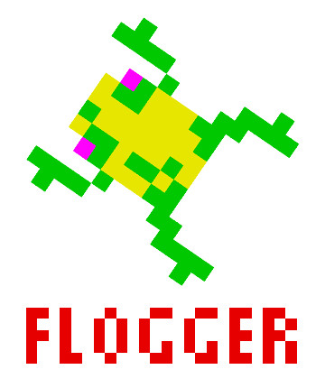

# vue-flogger-log
## A simple [Vue.js](https://vuejs.org/) plugin for [flogger-log](https://www.npmjs.com/package/flogger-log).


## Install
`npm install --save 'vue-flogger-log'`

## Getting started
***In your main.js***
```Javascript
import Vue from 'vue';
import Flogger from 'flogger-log';
import VueFlogger from 'vue-flogger-log';

// Instantiate flogger-log as usual
const flogger = new Flogger(/*...*/);

// Install vue-flogger-log on Vue
Vue.use(VueFlogger, flogger);
```

This will add a `flogger` property to Vue class, and a `$flogger` property to any Vue instance (your components).
Both are references to the `flog` instance.

## Usage in components
You will be able to access the flogger-log instance from inside your components at `this.$flogger`:
```Javascript
this.$flogger.$debug();
this.$flogger.$error();
this.$flogger.log();
/*...*/
```

## Usage outside .vue files
```Javascript
Vue.flogger.$debug();
Vue.flogger.$error();
Vue.flogger.log();
/*...*/
```

## License

```
MIT License

Copyright (c) 2020 Valerio Bianchi

Permission is hereby granted, free of charge, to any person obtaining a copy
of this software and associated documentation files (the "Software"), to deal
in the Software without restriction, including without limitation the rights
to use, copy, modify, merge, publish, distribute, sublicense, and/or sell
copies of the Software, and to permit persons to whom the Software is
furnished to do so, subject to the following conditions:

The above copyright notice and this permission notice shall be included in all
copies or substantial portions of the Software.

THE SOFTWARE IS PROVIDED "AS IS", WITHOUT WARRANTY OF ANY KIND, EXPRESS OR
IMPLIED, INCLUDING BUT NOT LIMITED TO THE WARRANTIES OF MERCHANTABILITY,
FITNESS FOR A PARTICULAR PURPOSE AND NONINFRINGEMENT. IN NO EVENT SHALL THE
AUTHORS OR COPYRIGHT HOLDERS BE LIABLE FOR ANY CLAIM, DAMAGES OR OTHER
LIABILITY, WHETHER IN AN ACTION OF CONTRACT, TORT OR OTHERWISE, ARISING FROM,
OUT OF OR IN CONNECTION WITH THE SOFTWARE OR THE USE OR OTHER DEALINGS IN THE
SOFTWARE.
```